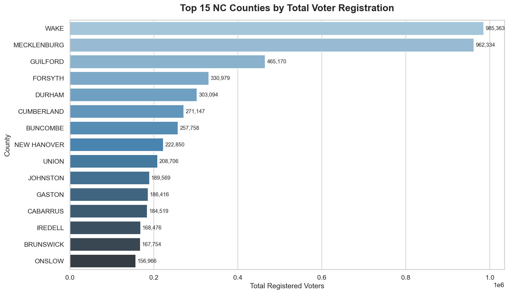
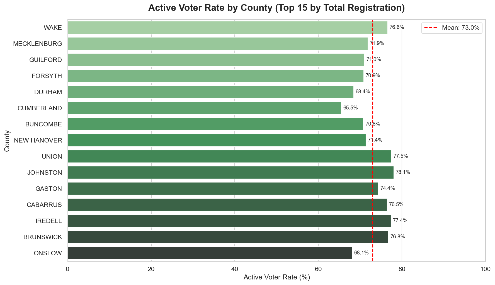
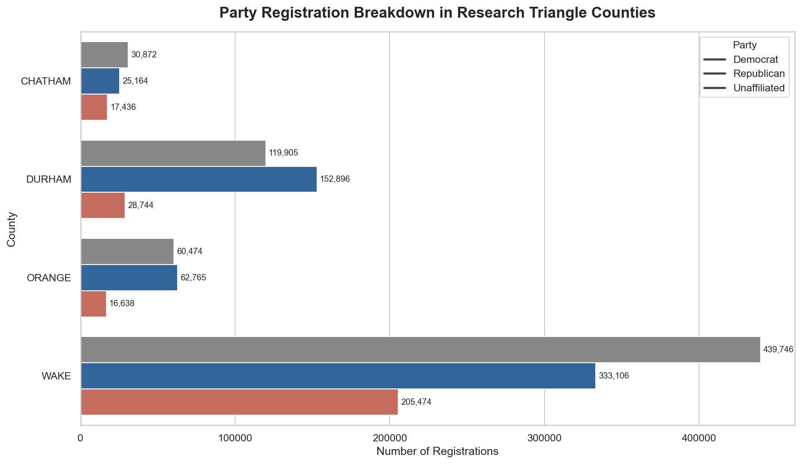
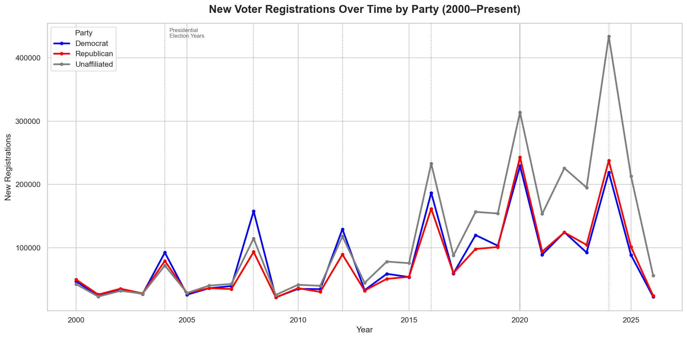
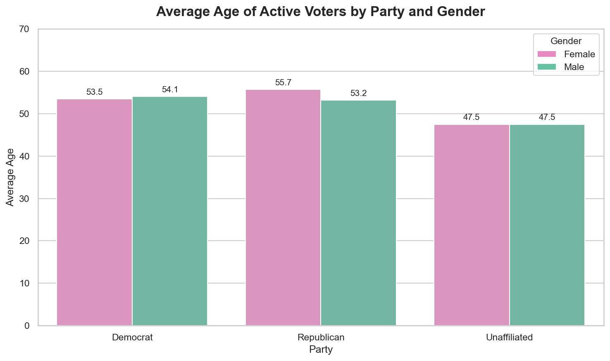

# North Carolina Voter Registration - Exploratory Data Analysis

## Overview

An exploratory data analysis of North Carolina voter registration data sourced from the NC State Board of Elections. This project uses PostgreSQL for data storage and querying, and Python (Pandas, Seaborn, Matplotlib) for analysis and visualization across ~9.1 million voter records statewide.

## Key Questions Explored

- How does voter registration vary across NC's 100 counties?
- What are party affiliation patterns in Research Triangle counties?
- How have registration trends shifted over time by party affiliation?
- How do age and gender correlate with party affiliation among active voters?

## Key Findings

- **Unaffiliated voters are the plurality in Wake County.** The number of Unaffiliated registrations (439,746) exceed both Democrats (333,106) and Republicans (205,474) in the state's most populous county.
- **Unaffiliated registrations have surged since 2015,** exceeding both major parties in new registrations by 2024, suggesting increasing disaffiliation from traditional party structures.
- **Presidential election years drive clear registration spikes,** across all parties, confirmed by peaks aligning with every election cycle from 2004 to 2024.
- **Unaffiliated voters are younger than party aligned voters.** The average age for Unaffiliated voters is 47.5 years old, roughly 6 years younger than active Democrats (53-54) and Republicans (53-55), suggesting younger voters increasingly avoid formal party affiliation.
- **Cumberland and Onslow counties show below-average active voter rates,** 65.5% and 68.1% respectively, likely driven by military relocations from Fort Liberty and Camp Lejeune.
- **Democrats show a significant gender gap compared to Republicans in NC.** Active female Democratic voters (1.16M) outnumber male (700K) at nearly a 2:1 ratio, while Republicans are nearly gender balanced.

## Visualizations

### Top 15 Counties by Total Voter Registration



### Active Voter Rate by County



### Party Registration in Research Triangle Counties



### New Voter Registrations Over Time by Party



### Average Age of Active Voters by Party and Gender



## Tools & Technologies

- **PostgreSQL** - data storage, querying, and aggregation.
- **Python** - data analysis and visualization.
  - Pandas - data manipulation and inspection.
  - Seaborn & Matplotlib - data visualization.
  - SQLAlchemy - database connection.
- **Jupyter Notebooks** - analysis environment.
- **Git & GitHub** - version control and project hosting.

## Dataset

- **Source:** NC State Board of Elections
- **URL:** https://www.ncsbe.gov/results-data/voter-registration-data
- **Records:** ~9.1 million statewide voter registrations
- **Note:** Raw data file is excluded from this repository via
  .gitignore. Download instructions below.

## How to Reproduce This Analysis

### Prerequisites

- PostgreSQL installed locally
- Conda or Python 3.11+ with required libraries

### Setup Instructions

1. Clone this repository:

```bash
git clone https://github.com/admcbride02/nc-voter-registration-eda.git
cd nc-voter-registration-eda
```

2. Create and activate conda environment:

```bash
conda env create -f environment.yml
conda activate voter-eda
```

3. Download the voter registration data:

- Go to https://www.ncsbe.gov/results-data/voter-registration-data.
- Download the statewide snapshot file.
- Place it in the project root directory.

4. Set up PostgreSQL database:

- Create a database named `nc_voters`.
- Run the schema creation script in `setup/schema.sql`.
- Import the data file using psql:

```bash
psql -U postgres -d nc_voters -c "\copy voter_registration FROM 'ncvoter_Statewide.txt' WITH (FORMAT CSV, DELIMITER E'\t', HEADER true, QUOTE '\"', ENCODING 'LATIN1')"
```

5. Open the notebook:

```bash
jupyter notebook eda_notebook.ipynb
```

## Author

Andrew McBride  
[LinkedIn](https://www.linkedin.com/in/andrew-d-mcbride-678457290) | [GitHub](https://github.com/admcbride02)
